# ShopHub — App Folder Workflow

Yeh document `app/` folder ke andar sab kuch kaise connect hota hai, step-by-step explain karta hai.

---

## 1. Folder Structure

```
app/
├── __init__.py          # App factory — sab kuch yahan jodta hai
├── models/              # Database tables (SQLAlchemy)
├── routes/              # URLs handle karta hai (Blueprints)
├── services/            # Business logic (tax, stock, recommendations)
├── templates/           # HTML pages (Jinja2)
└── static/              # CSS, JS, placeholder images
```

| Folder / File | Role |
|---------------|------|
| `__init__.py` | Flask app create, config, DB, login, blueprints register |
| `models/` | Data structure — User, Product, Order, Cart, etc. |
| `routes/` | HTTP request aaya → logic chala → response bheja |
| `services/` | Reusable logic jo routes se alag rakhi gayi hai |
| `templates/` | User ko dikhne wala HTML |
| `static/` | Browser directly load karta hai (CSS, JS, images) |

---

## 2. App Startup Flow

Server start hone par yeh sequence chalta hai:

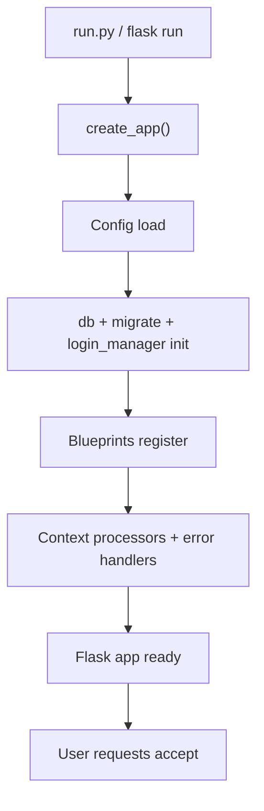

**Steps:**

1. Root se `create_app()` call hota hai (`app/__init__.py`).
2. Config set hoti hai — DB URL, secret key, shipping, tax, upload path.
3. Extensions initialize hote hain — `SQLAlchemy`, `Migrate`, `LoginManager`.
4. Saare blueprints register hote hain — auth, products, cart, orders, wishlist, admin.
5. Har template ko global data milta hai — `cart_count`, `wishlist_count`, `nav_categories`.
6. App requests sunne ke liye ready ho jati hai.

---

## 3. Request Lifecycle (Har page ka common flow)

User jab bhi koi URL open karta hai, yeh flow chalta hai:

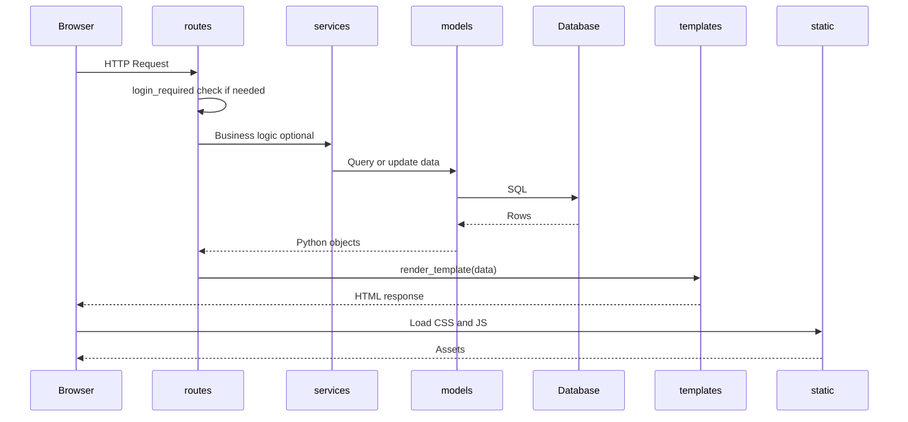

**Example:** User `/products` kholta hai

1. `routes/products.py` → `product_list()` run hota hai
2. `Product` model se DB query hoti hai (filter, sort, pagination)
3. `templates/products/list.html` render hota hai
4. Browser `static/css/main.css` aur `static/js/main.js` load karta hai

---

## 4. Architecture Layers

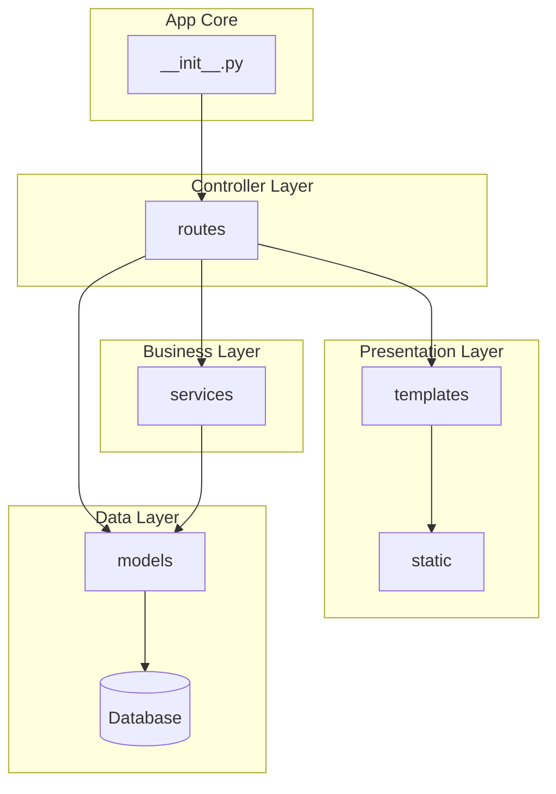

| Layer | Responsibility |
|-------|----------------|
| Presentation | UI dikhana — HTML, CSS, JS |
| Controller | URL → action map karna |
| Business | Calculations, recommendations, stock rules |
| Data | DB tables aur relationships |
| App Core | Sab layers ko ek saath jodna |

---

## 5. Blueprint Map (Kaun sa route kahan hai)

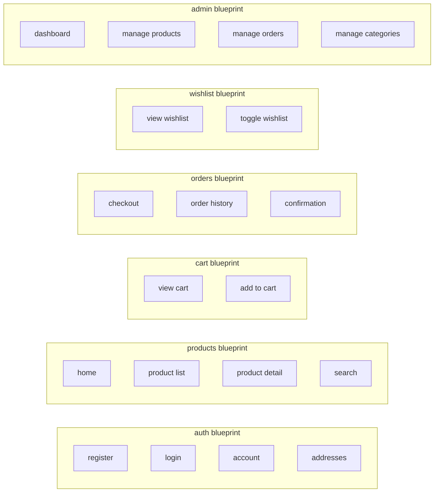

---

## 6. Feature Workflows

### 6.1 User Registration and Login

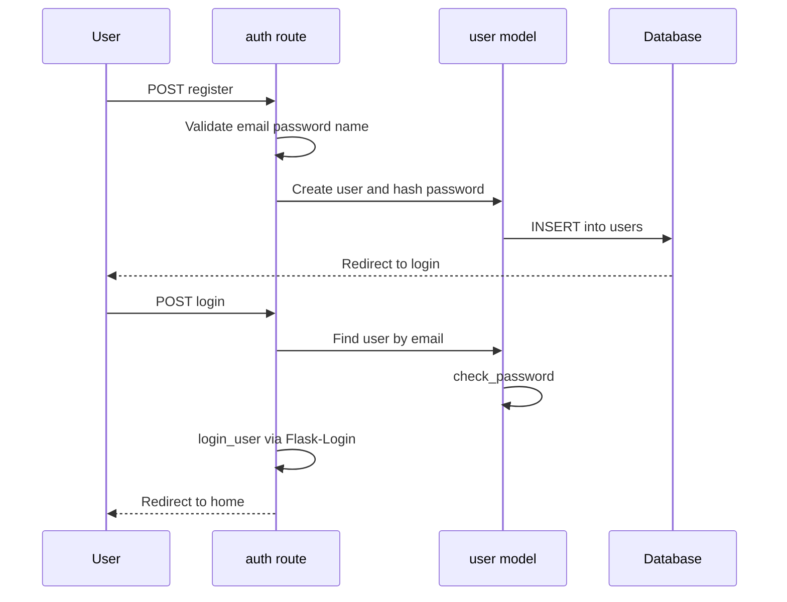

**Files involved:** `routes/auth.py`, `models/user.py`, `templates/auth/register.html`, `templates/auth/login.html`

---

### 6.2 Browse and Search Products

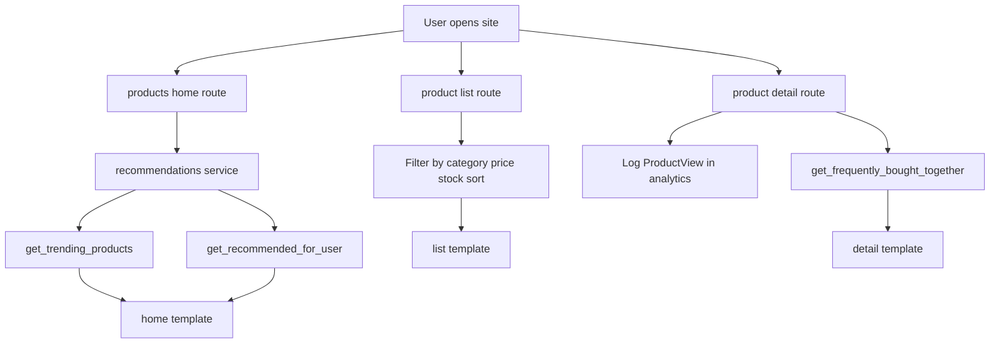

---

### 6.3 Add to Cart (AJAX)

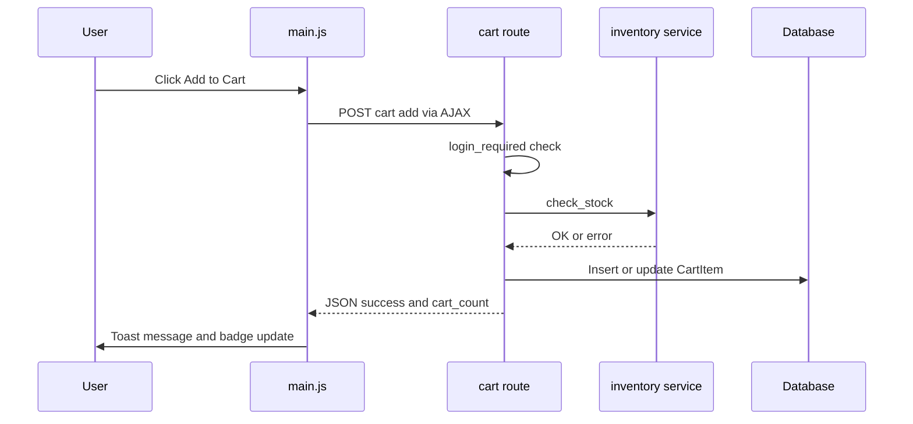

**Files involved:** `routes/cart.py`, `models/cart.py`, `services/inventory.py`, `static/js/main.js`

---

### 6.4 Checkout and Place Order

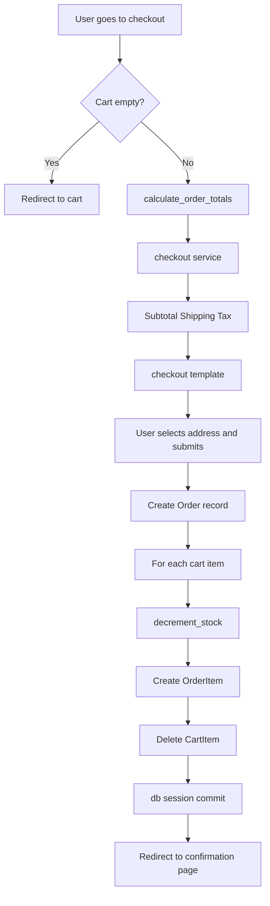

**Checkout totals logic** (`services/checkout.py`):

| Component | Rule |
|-----------|------|
| Subtotal | Saare cart items ka sum |
| Shipping | Flat rate; free agar subtotal >= threshold |
| Tax | Subtotal × TAX_RATE (default 18%) |
| Total | Subtotal + Shipping + Tax |

---

### 6.5 Wishlist Toggle

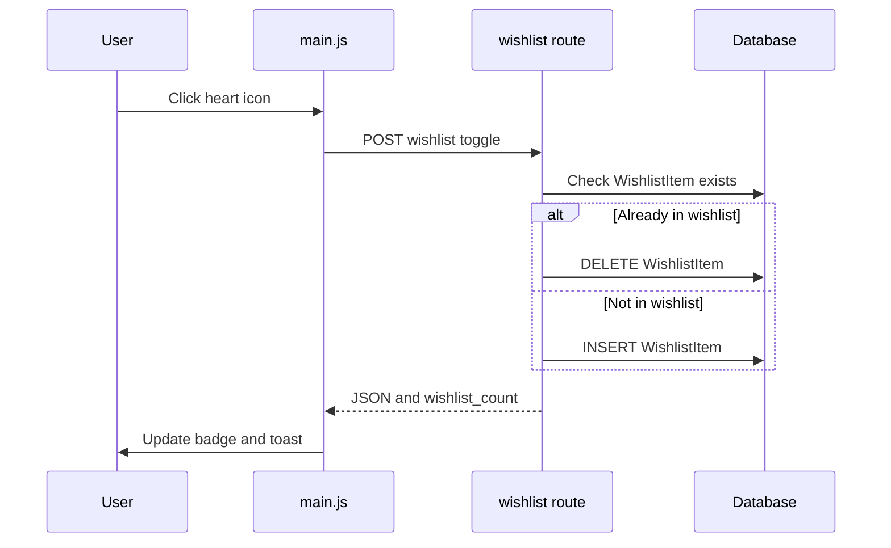

---

### 6.6 Admin Panel

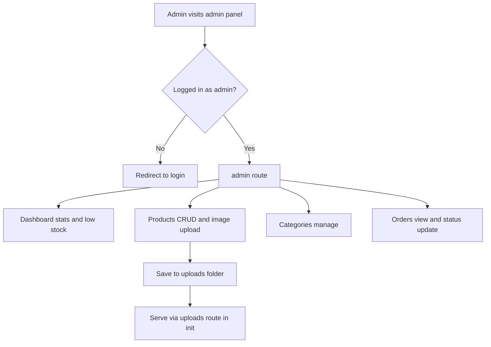

**Admin guard:** `routes/auth.py` mein `admin_required` decorator — sirf `role == "admin"` wale user ko access.

---

### 6.7 Recommendations Engine

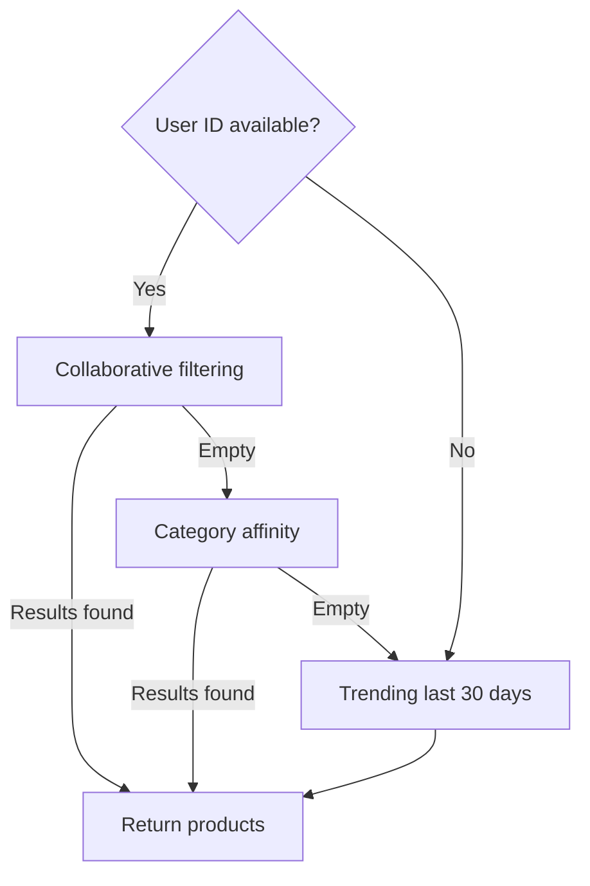

**Data sources:**
- `models/analytics.py` → `ProductView` (kya dekha)
- `models/order.py` → `OrderItem` (kya khareeda)
- `services/recommendations.py` → sab logic yahan

---

## 7. Models Relationship (Database)

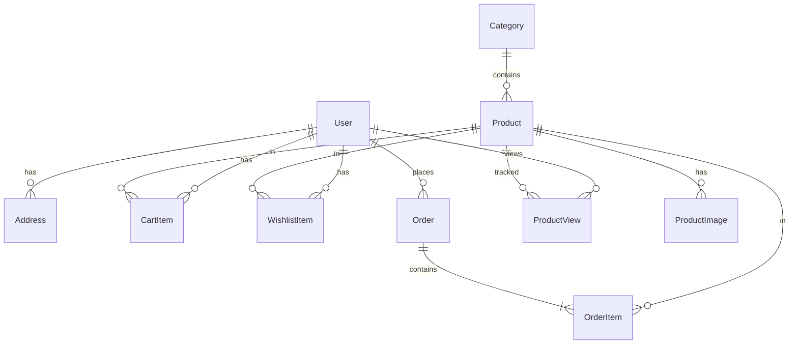

---

## 8. Global Context (Har page pe automatically)

`__init__.py` ka `inject_globals()` har template ko yeh data deta hai:

| Variable | Source | Use |
|----------|--------|-----|
| `current_user` | Flask-Login | Login state, nav links |
| `cart_count` | `CartItem` sum | Header badge |
| `wishlist_count` | `WishlistItem` count | Header badge |
| `wishlist_product_ids` | Wishlist query | Heart icon filled/empty |
| `nav_categories` | Top-level `Category` | Navigation menu |
| `current_year` | `datetime.utcnow()` | Footer copyright |

---

## 9. Static Assets Flow

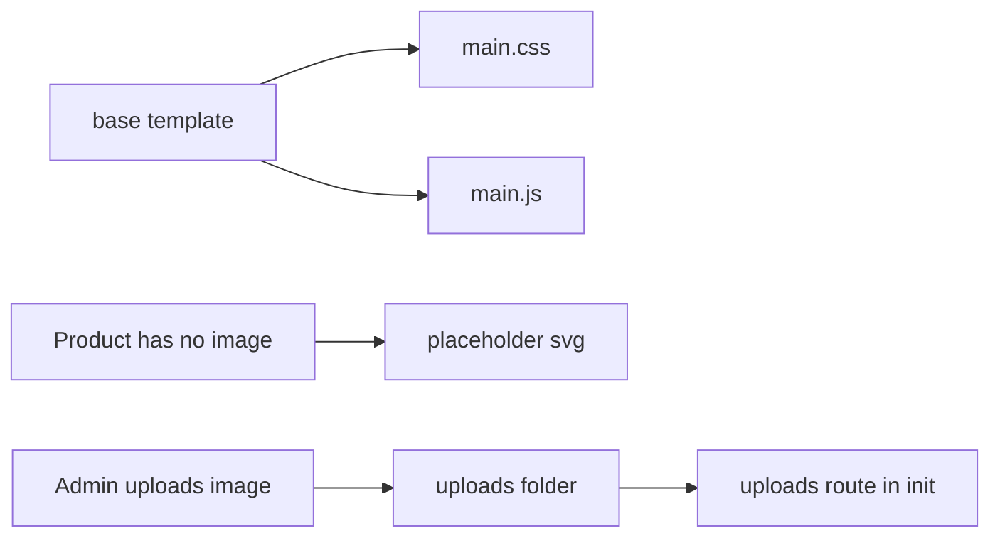

**Template filter:** `product_image_url` — image path ko sahi URL mein convert karta hai (upload ya placeholder).

---

## 10. Error Handling

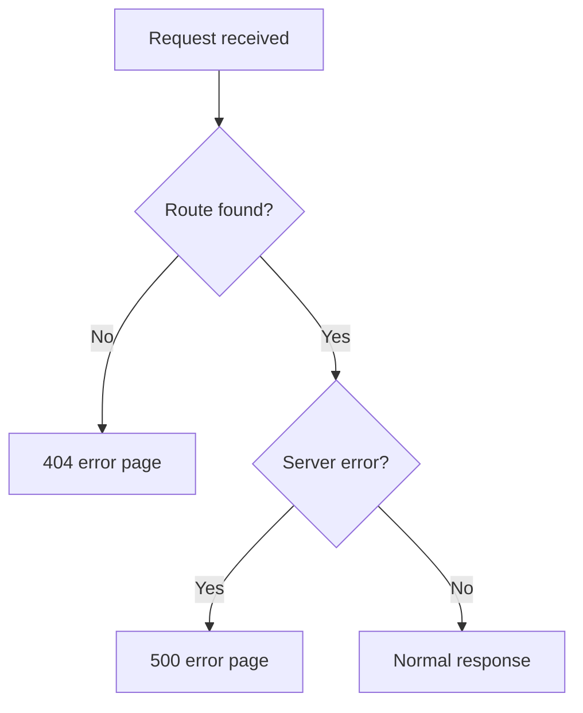

Handlers `app/__init__.py` mein registered hain.

---

## 11. Quick Reference — File to Feature

| Feature | Primary files |
|---------|---------------|
| App bootstrap | `app/__init__.py` |
| User auth | `routes/auth.py`, `models/user.py` |
| Product catalog | `routes/products.py`, `models/product.py`, `models/category.py` |
| Shopping cart | `routes/cart.py`, `models/cart.py` |
| Checkout | `routes/orders.py`, `services/checkout.py`, `services/inventory.py` |
| Wishlist | `routes/wishlist.py`, `models/wishlist.py` |
| Recommendations | `services/recommendations.py`, `models/analytics.py` |
| Admin | `routes/admin.py`, `templates/admin/*` |
| UI layout | `templates/base.html`, `static/css/main.css` |
| AJAX interactions | `static/js/main.js` |

---

## 12. End-to-End User Journey

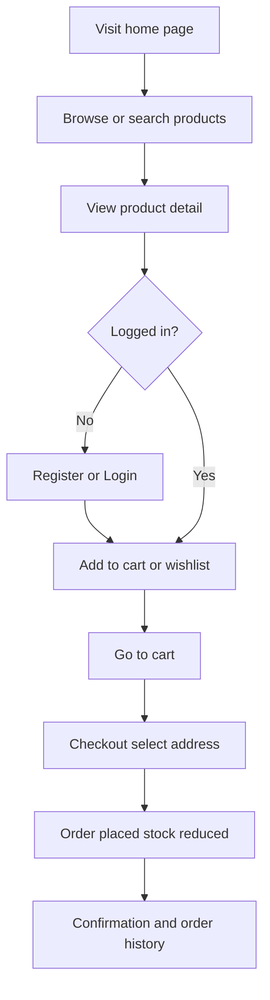

Yeh poora flow `app/` folder ke andar ke routes, services, models, templates aur static files mil kar complete karte hain.
